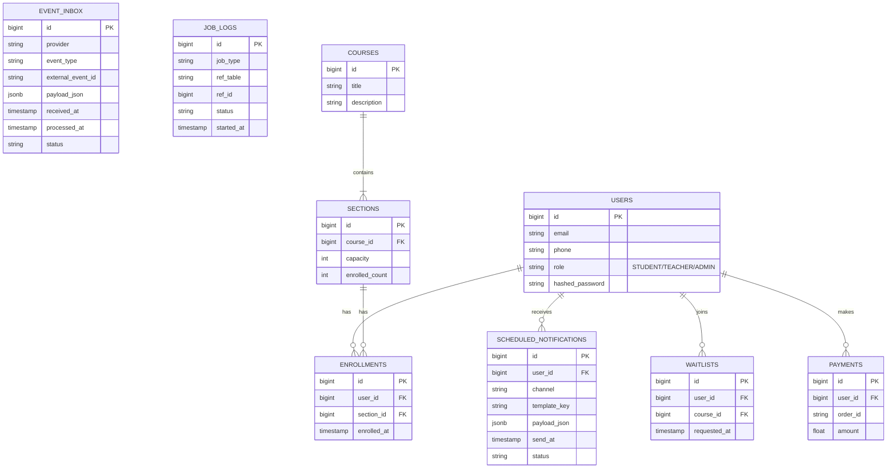

# Entity-Relationship Diagram (ERD) Overview

Below is a high-level Entity-Relationship representation of the core tables necessary for the platform.

## Description of Core Tables
1. **Event Inbox**: The entry portal for webhooks. Guarantees auditability and idempotency.
2. **Scheduled Notifications**: The automation workflow engine where all future events (reminders, expiry warnings) sit until Celery Beat dispatches them.
3. **Job Logs**: Traceability for all background Celery tasks, essential for university administration audits.
4. **Domain Tables**: (Users, Courses, Sections, Enrollments, Waitlists, Payments) manage the standard academic rules and constraints.
